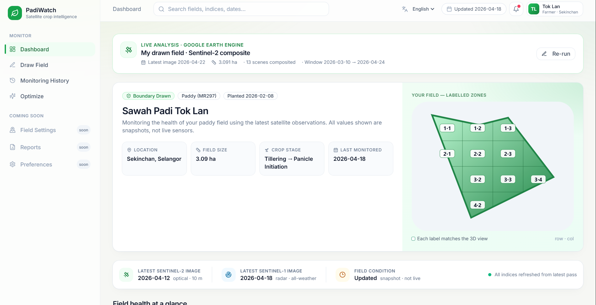

# PadiWatch — AI-Powered Field Intelligence for Malaysian Paddy Farmers

> **MY AI Future Hackathon Project**
> Empowering smallholder rice farmers with satellite imagery and multi-agent AI to monitor, diagnose, and act — in their own language.

**Team Name:**
SevenAteNine

**Team Members:**
-Muhammad Izzul Danish bin Abdul Rasib (SW01083596)
-Mohd Adli Syukri bin Noraman (SW01083745)
-Muhammad Irfan Azraei bin Izhar Kamil (SW01083594)
-Muhammad Yasin bin Shahrozaini (CS01083764)

[See the web](https://padiwatch-vwcntllwcq-uc.a.run.app)



---

## Table of Contents

- [Overview](#overview)
- [Problem Statement](#problem-statement)
- [Solution](#solution)
- [Features](#features)
- [Tech Stack](#tech-stack)
- [Architecture](#architecture)
- [AI & Agent Pipeline](#ai--agent-pipeline)
- [Agricultural Indices](#agricultural-indices)
- [API Reference](#api-reference)
- [Getting Started](#getting-started)
- [Environment Variables](#environment-variables)
- [Project Structure](#project-structure)
- [Localization](#localization)
- [Team](#team)

---

## Overview

**PadiWatch** is a full-stack precision agriculture platform that brings together **satellite remote sensing** and **multimodal AI** to give Malaysian paddy farmers a real-time window into their field health — without needing any specialized knowledge.

A farmer draws their field boundary on a map. PadiWatch fetches the latest Sentinel-2 satellite imagery, computes four critical agricultural health indices across a 4×4 zone grid, and then unleashes a **3-agent AI reasoning pipeline** (Visual Analyst → Diagnostic Agronomist → Action Planner) that produces a prioritized, plain-language action checklist — ready to execute today.

---

## Problem Statement

Malaysian smallholder paddy farmers — particularly in Kedah, Kelantan, and MADA granary areas — face recurring crop stress, nutrient deficiencies, water management problems, and pest pressure. Traditional diagnosis methods are:

- **Slow**: Field inspections happen infrequently; problems are detected late.
- **Expensive**: Agronomist consultations are inaccessible for small plots.
- **Technical**: Existing satellite platforms (e.g., Sentinel Hub) require GIS expertise far beyond the average farmer's reach.
- **Monolingual**: Most tools are English-only.

The result: farmers guess, react late, and suffer avoidable yield loss.

---

## Solution

PadiWatch removes every barrier between satellite data and the farmer's next decision:

| Barrier | PadiWatch's Answer |
|---|---|
| GIS expertise needed | Draw your field on a map — that's it |
| Satellite data is raw numbers | 4 color-coded index heatmaps with plain explanations |
| Diagnosis requires an agronomist | 3-agent AI pipeline cross-correlates all indices automatically |
| Complex reports | Form-3 reading level, farmer-friendly language |
| English-only tools | English, Bahasa Malaysia, Mandarin, Tamil |
| Too slow to act | Urgency-rated checklist: Today / This Week / Monitor |

---

## Features

### 1. Interactive Field Mapping

- Draw your paddy field boundary as a polygon directly on a **Leaflet.js** interactive map.
- Search for your location by name using a Google Maps Geocoding-powered search bar.
- Supports any field shape and size.

### 2. Real-Time Satellite Index Analysis

PadiWatch queries **Google Earth Engine (Sentinel-2 composite imagery)** for your exact field area and computes four agricultural health indices:

| Index | What It Measures | Why It Matters |
|---|---|---|
| **NDVI** | Plant vigor and canopy greenness | Overall crop health baseline |
| **NDRE** | Mid-canopy stress | Early nitrogen/chlorophyll stress detection |
| **LSWI** | Soil and plant water content | Irrigation sufficiency, waterlogging detection |
| **GCI** | Green chlorophyll (nitrogen proxy) | Nutrient status, fertilizer timing |

- Rendered as color-coded **tile map overlays** — green (healthy) to red (stressed).
- Values provided for the whole field and broken down across a **4×4 zone grid** (16 sub-areas).
- Metadata shown: image acquisition date, number of satellite scenes composited, field area.

### 3. AI Index Recommendations (Per-Index Reports)

Click any index card to enter a detailed view. PadiWatch sends the satellite image plus zone-level numeric data to **Gemini 2.5 Flash** and receives back:

- **Headline** — one-sentence summary of what's happening in the field.
- **Severity level** — Healthy / Moderate / Needs Attention.
- **What's happening** — plain-language explanation of the index reading.
- **Likely causes** — ordered by probability (e.g., drought, nutrient deficiency, pest pressure).
- **Action steps** — timed recommendations: *Today*, *This Week*, *Monitor*.
- **Zone action matrix** — a 4×4 visual showing exactly which zones need what action.

### 4. Multi-Agent Field Optimizer (Streaming)

The flagship feature. PadiWatch runs a **sequential 3-agent reasoning pipeline** built on **Google ADK (Agent Development Kit)**:

```
Visual Analyst → Diagnostic Agronomist → Action Planner
```

The entire pipeline streams **live** to the UI via Server-Sent Events (SSE), so you watch the agents think in real time.

**Visual Analyst**
- Fetches all 4 index values across the 16-zone grid.
- Flags problem zones (NDVI < 0.4, LSWI < −0.1, GCI < 2.0).
- Generates an annotated satellite image marking stressed areas.

**Diagnostic Agronomist**
- Cross-correlates all four indices to identify the root cause:
  - Low NDVI + Low LSWI → **Drought stress**
  - Low NDVI + Low GCI → **Nutrient deficiency**
  - Low NDVI + High LSWI → **Pest/disease or waterlogging**
- Produces a structured diagnosis per zone.

**Action Planner**
- Converts diagnoses into a farmer-ready **urgency-rated checklist**.
- Assigns each action a priority: **Immediate** / **Short-term** / **Monitoring**.
- Generates a field health score (0–100).

**Optimizer output delivered to the UI:**
- Annotated farm image with stressed zones highlighted.
- Overall field health score.
- Full action checklist with timing and zone references.
- Live agent trace showing each reasoning step.

### 5. Historical Session Tracking

- Every analysis is saved to **LocalStorage** (last 50 sessions).
- Revisit any prior field scan from the dashboard.
- No account or database required — works entirely offline after analysis.

### 6. Multi-Language Support

All AI-generated recommendations, index explanations, and UI text are available in:

- English
- Bahasa Malaysia
- Mandarin (中文)
- Tamil (தமிழ்)

Language is passed through the entire analysis pipeline — GEE computation metadata, Gemini prompts, agent outputs — so every word the farmer reads is in their chosen language.

---

## Tech Stack

### Frontend

| Layer | Technology |
|---|---|
| Framework | React 18 + Vite |
| Language | TypeScript (strict mode) |
| Map & Drawing | Leaflet.js + leaflet-draw |
| Styling | Tailwind CSS + Radix UI (shadcn/ui) |
| State Management | React Context API |
| Persistence | LocalStorage |
| i18n | i18next + react-i18next |
| Routing | React Router v6 |
| Icons | Lucide React |

### Backend

| Layer | Technology |
|---|---|
| Framework | FastAPI (Python 3.12+) |
| ASGI Server | Uvicorn |
| Remote Sensing | Google Earth Engine Python API |
| AI Model | Gemini 2.5 Flash (via Vertex AI) |
| Agent Framework | Google ADK (Agent Development Kit) |
| Image Processing | Pillow (PIL) |
| Data Validation | Pydantic |
| Configuration | python-dotenv |

### Google Cloud Services

| Service | Used For |
|---|---|
| **Google Earth Engine** | Sentinel-2 satellite imagery, index computation, tile URL generation |
| **Vertex AI (Gemini 2.5 Flash)** | Multimodal AI — vision + text reasoning for analysis and recommendations |
| **Google ADK** | Multi-agent pipeline orchestration |
| **Google Maps Geocoding API** | Location search (server-side proxy) |

---

## Architecture

```
┌─────────────────────────────────────────────────────────┐
│                   FRONTEND (React/TypeScript)            │
│                                                         │
│   Dashboard  ─  IndexDetails  ─  Optimize               │
│       │               │              │                  │
│   Map + Draw     Heatmap + AI    Agent Cards            │
│                   Report        + Checklist             │
│                                                         │
│               AnalysisProvider (Context)                │
│          LocalStorage: current, history, farmView       │
└──────────────────────────┬──────────────────────────────┘
                           │ HTTP / SSE (Fetch API)
┌──────────────────────────▼──────────────────────────────┐
│                   BACKEND (FastAPI)                      │
│                                                         │
│  POST /api/analyze   →  GEE index computation           │
│  POST /api/recommend →  Gemini per-index advisory       │
│  POST /api/farm-view →  Vertex AI zone analysis         │
│  POST /api/optimize  →  SSE multi-agent pipeline        │
│  GET  /api/geocode   →  Google Maps proxy               │
│  GET  /api/health    →  Status check                    │
│                                                         │
│  vertex_analyze.py    vertex_recommend.py               │
│  optimization_stream.py   agents/ (ADK pipeline)        │
└────────────┬─────────────────┬──────────────────────────┘
             │                 │
     ┌───────▼──────┐  ┌───────▼───────┐   ┌─────────────┐
     │   Google     │  │  Vertex AI    │   │  Google     │
     │   Earth      │  │  Gemini 2.5   │   │  Maps       │
     │   Engine     │  │  Flash        │   │  Geocoding  │
     │  Sentinel-2  │  │  (Vision +    │   │  API        │
     │  Landsat     │  │   Reasoning)  │   │             │
     └──────────────┘  └───────────────┘   └─────────────┘
```

### Data Flow — Field Analysis

```
1. User draws polygon on map (Leaflet)
2. POST /api/analyze { geometry, language }
3. Backend → GEE: fetch Sentinel-2 composite, cloud-masked
4. GEE computes NDVI, NDRE, LSWI, GCI for geometry
5. GEE returns tile URLs + field-level means + zone grid values
6. Frontend renders heatmap overlays + summary metric cards
```

### Data Flow — Multi-Agent Optimization (Streaming)

```
1. User clicks "Generate Field Plan"
2. POST /api/optimize (EventSource / SSE)
3. Backend creates session, prepares GEE scene
4. SSE events streamed to frontend:
   run_started → scene_ready → agent_started → tool_called
   → tool_result → agent_output → agent_finished → final
5. Frontend state machine (AnalysisProvider) processes each event
6. UI renders: live agent trace, annotated image, checklist, score
```

---

## AI & Agent Pipeline

### Agent 1 — Visual Analyst

**Tools available:** `fetch_field_indices`, `generate_annotated_image`

Fetches the raw 4×4 grid data for all four indices. Identifies zones below healthy thresholds and flags them as problem areas. Produces an annotated image with stressed zones overlaid.

### Agent 2 — Diagnostic Agronomist

**Tools available:** `fetch_field_indices`, `fetch_weather_forecast`

Receives the Visual Analyst's findings. Cross-correlates all four index readings using established agronomic logic to determine the root cause of stress in each problem zone:

| Pattern | Diagnosis |
|---|---|
| Low NDVI + Low LSWI | Drought / Water Stress |
| Low NDVI + Low GCI | Nutrient Deficiency |
| Low NDVI + High LSWI | Pest, Disease, or Waterlogging |
| All indices normal | Field Healthy |

### Agent 3 — Action Planner

**Tools available:** `fetch_field_indices`

Receives the diagnoses and maps them to an urgency-rated action checklist. Outputs a structured plan with:

- **Immediate** — act today (e.g., emergency irrigation, fungicide application)
- **Short-term** — act this week (e.g., fertilizer schedule, drainage improvement)
- **Monitoring** — observe and reassess (e.g., track NDVI recovery)

Each action references the specific zone(s) it applies to.

### Structured Output

All agent outputs are enforced via **JSON schema validation**, ensuring the frontend receives reliable, parseable data regardless of model verbosity.

---

## Agricultural Indices

### Index Formulas (Sentinel-2 Bands)

```
NDVI  = (B8 − B4) / (B8 + B4)     # Near-Infrared vs Red
NDRE  = (B8 − B5) / (B8 + B5)     # Near-Infrared vs Red-Edge
LSWI  = (B8 − B11) / (B8 + B11)   # Near-Infrared vs SWIR
GCI   = (B8 / B3) − 1              # Near-Infrared / Green
```

### Health Thresholds

| Index | Healthy | Moderate | Needs Attention |
|---|---|---|---|
| NDVI | ≥ 0.5 | ≥ 0.3 | < 0.3 |
| NDRE | ≥ 0.2 | ≥ 0.1 | < 0.1 |
| LSWI | ≥ 0.0 | ≥ −0.1 | < −0.1 |
| GCI | ≥ 3.0 | ≥ 2.0 | < 2.0 |

### Color Palette

Each index tile is rendered with a meaningful color scale:
- **Green** → Healthy vegetation / adequate water
- **Yellow/Orange** → Moderate stress
- **Red** → Severe stress, immediate action needed

---

## API Reference

### `POST /api/analyze`

Compute satellite indices for a field polygon.

**Request body:**
```json
{
  "geometry": { "type": "Polygon", "coordinates": [...] },
  "start_date": "2024-01-01",
  "end_date": "2024-03-31",
  "language": "en"
}
```

**Response:**
```json
{
  "indices": [
    {
      "key": "ndvi",
      "name": "NDVI",
      "value": 0.62,
      "status": "healthy",
      "tile_url": "https://earthengine.googleapis.com/...",
      "zones": [[0.71, 0.68, ...], ...]
    }
  ],
  "image_date": "2024-03-15",
  "scene_count": 4,
  "area_ha": 2.3,
  "bounds": [...]
}
```

---

### `POST /api/recommend`

Get an AI-generated advisory for a single index.

**Request body:**
```json
{
  "geometry": { "type": "Polygon", "coordinates": [...] },
  "index_key": "ndvi",
  "language": "ms"
}
```

**Response:**
```json
{
  "headline": "Tekanan kemarau dikesan di zon timur laut",
  "severity": "needs_attention",
  "explanation": "...",
  "causes": ["Kekurangan air berpanjangan", "Saliran tidak mencukupi"],
  "steps": [
    { "timing": "today", "action": "Tingkatkan pengairan segera" },
    { "timing": "this_week", "action": "Periksa saluran air parit" }
  ],
  "zone_matrix": [[...], ...],
  "image_b64": "iVBORw0KGgo..."
}
```

---

### `POST /api/optimize` (SSE)

Stream the 3-agent optimization pipeline.

**Request body:**
```json
{
  "geometry": { "type": "Polygon", "coordinates": [...] },
  "language": "en"
}
```

**SSE event stream:**
```
data: {"type": "run_started", "session_id": "abc-123"}
data: {"type": "scene_ready", "image_date": "2024-03-15"}
data: {"type": "agent_started", "agent": "visual_analyst"}
data: {"type": "tool_called", "tool": "fetch_field_indices"}
data: {"type": "tool_result", "agent": "visual_analyst", "summary": "..."}
data: {"type": "agent_output", "agent": "visual_analyst", "result": {...}}
data: {"type": "agent_finished", "agent": "visual_analyst"}
...
data: {"type": "final", "health_score": 72, "checklist": [...], "annotated_image": "..."}
```

---

### `GET /api/geocode?q={location}`

Proxy for Google Maps Geocoding (protects API key server-side).

### `GET /api/health`

Returns service status and GEE configuration check.

---

## Getting Started

### Prerequisites

- Python 3.12+
- Node.js 18+
- Google Cloud project with these APIs enabled:
  - Earth Engine API
  - Vertex AI API
  - Maps Geocoding API
- Service account with Earth Engine and Vertex AI access
- Earth Engine project registered

### Backend Setup

```bash
cd backend

# Create virtual environment
python -m venv venv
source venv/bin/activate  # Windows: venv\Scripts\activate

# Install dependencies
pip install -r requirements.txt

# Set up environment variables (see below)
cp .env.example .env
# Edit .env with your credentials

# Run the backend
uvicorn main:app --reload --port 8000
```

### Frontend Setup

```bash
# From project root
npm install

# Start development server
npm run dev
```

The frontend dev server proxies API calls to `http://localhost:8000`.

### Production Build

```bash
npm run build          # Builds frontend to dist/
# FastAPI serves dist/ as static files automatically
uvicorn main:app --host 0.0.0.0 --port 8080
```

---

## Environment Variables

Create a `backend/.env` file:

```env
# Google Earth Engine
GEE_PROJECT_ID=your-gee-project-id
GEE_KEY_FILE=path/to/gee-service-account-key.json

# Vertex AI (Gemini)
GOOGLE_CLOUD_PROJECT=your-gcp-project-id
GOOGLE_CLOUD_LOCATION=us-central1
VERTEX_KEY_FILE=path/to/vertex-service-account-key.json

# Google Maps Geocoding
GOOGLE_MAPS_API_KEY=your-maps-api-key
```

---

## Project Structure

```
MyAIFuture/
├── backend/
│   ├── main.py                    # FastAPI app, routes, CORS
│   ├── gee.py                     # Earth Engine client, index computation
│   ├── vertex_analyze.py          # Gemini zone-level analysis
│   ├── vertex_recommend.py        # Gemini per-index recommendations
│   ├── optimization_stream.py     # SSE event streaming
│   ├── requirements.txt
│   └── agents/
│       ├── __init__.py            # Pipeline documentation
│       ├── orchestrator.py        # 3-agent ADK composition
│       ├── visual_analyst.py      # Agent 1
│       ├── diagnostic_agronomist.py  # Agent 2
│       ├── action_planner.py      # Agent 3
│       └── tools.py               # Shared tools (GEE, image, weather)
│
├── src/
│   ├── pages/
│   │   ├── Dashboard.tsx          # Main view: map, index cards
│   │   ├── IndexDetails.tsx       # Per-index deep dive + AI report
│   │   └── Optimize.tsx           # Multi-agent optimizer UI
│   ├── components/
│   │   └── dashboard/
│   │       └── IndexCard.tsx      # Health summary card
│   ├── services/
│   │   ├── gee.ts                 # API client: analyze, recommend, geocode
│   │   ├── optimize.ts            # SSE streaming client
│   │   └── farmView.ts            # Farm view API client
│   ├── state/
│   │   └── analysis.tsx           # AnalysisProvider (global state)
│   ├── types/
│   │   └── index.ts               # TypeScript interfaces
│   └── i18n/                      # Translation files (en, ms, zh, ta)
│
├── public/
├── index.html
├── vite.config.ts
├── tailwind.config.js
└── package.json
```

---

## Localization

PadiWatch supports **4 languages** through i18next, with language selection propagated to both the UI and the AI inference pipeline:

| Code | Language |
|---|---|
| `en` | English |
| `ms` | Bahasa Malaysia |
| `zh` | Mandarin (中文) |
| `ta` | Tamil (தமிழ்) |

Gemini prompts are dynamically constructed with the selected language, so recommendations, headlines, cause explanations, and action checklists are all generated natively in the farmer's chosen language — not translated after the fact.

---

## Hackathon Context

**Competition:** MY AI Future Hackathon
**Theme:** Leveraging AI for national impact

PadiWatch directly addresses Malaysia's food security by equipping the ~200,000 paddy farming households — who contribute to the national rice supply — with AI tools previously only available to large agribusinesses and government agencies.


**Key differentiators for the hackathon:**
- End-to-end Google Cloud AI stack (GEE + Vertex AI + ADK)
- Real satellite data, not synthetic demos
- Multi-agent reasoning, not just a single LLM call
- Production-grade SSE streaming architecture
- Genuine multilingual support for Malaysia's farming communities

---

*Built with Google Earth Engine, Vertex AI (Gemini 2.5 Flash), Google ADK, React, and FastAPI.*
