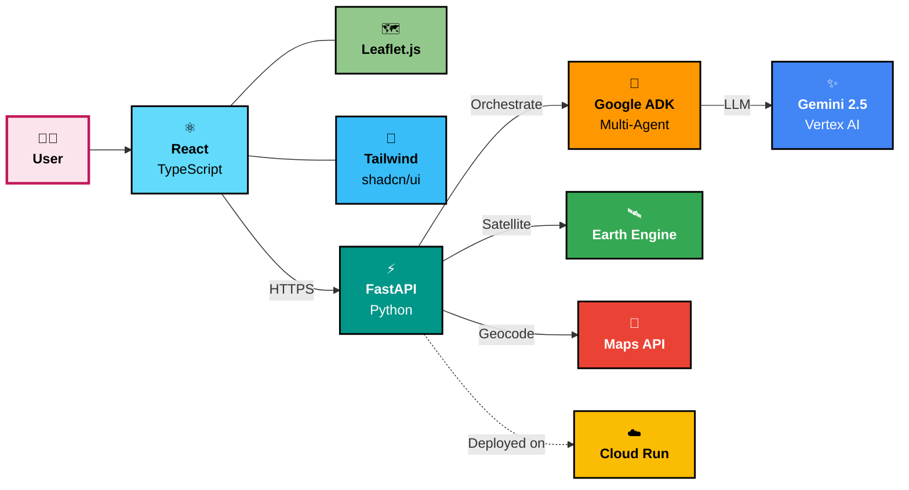
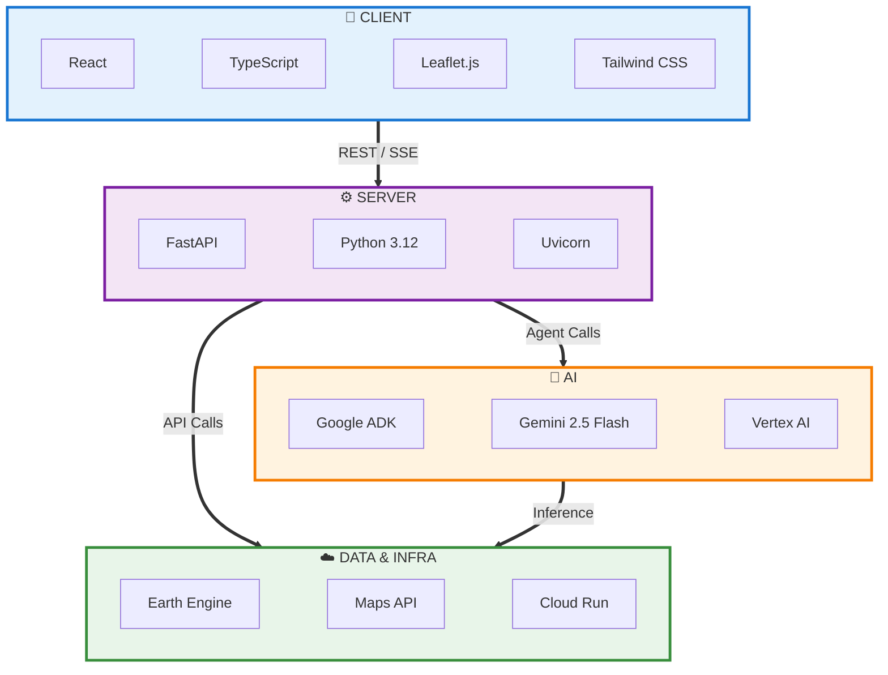

# PadiWatch — Tech Stack

```mermaid
flowchart LR
    User["👨‍🌾<br/><b>User</b>"]

    React["⚛️<br/><b>React</b><br/>TypeScript"]
    Leaflet["🗺️<br/><b>Leaflet.js</b>"]
    Tailwind["🎨<br/><b>Tailwind</b><br/>shadcn/ui"]

    FastAPI["⚡<br/><b>FastAPI</b><br/>Python"]

    ADK["🤖<br/><b>Google ADK</b><br/>Multi-Agent"]
    Gemini["✨<br/><b>Gemini 2.5</b><br/>Vertex AI"]
    GEE["🛰️<br/><b>Earth Engine</b>"]
    Maps["📍<br/><b>Maps API</b>"]

    CloudRun["☁️<br/><b>Cloud Run</b>"]

    User --> React
    React --- Leaflet
    React --- Tailwind
    React -->|HTTPS| FastAPI
    FastAPI -->|Orchestrate| ADK
    ADK -->|LLM| Gemini
    FastAPI -->|Satellite| GEE
    FastAPI -->|Geocode| Maps
    FastAPI -.->|Deployed on| CloudRun

    style User fill:#fce4ec,stroke:#c2185b,stroke-width:3px,color:#000
    style React fill:#61dafb,stroke:#000,stroke-width:2px,color:#000
    style Leaflet fill:#93c88d,stroke:#000,stroke-width:2px,color:#000
    style Tailwind fill:#38bdf8,stroke:#000,stroke-width:2px,color:#000
    style FastAPI fill:#009688,stroke:#000,stroke-width:2px,color:#fff
    style ADK fill:#ff9800,stroke:#000,stroke-width:2px,color:#000
    style Gemini fill:#4285f4,stroke:#000,stroke-width:2px,color:#fff
    style GEE fill:#34a853,stroke:#000,stroke-width:2px,color:#fff
    style Maps fill:#ea4335,stroke:#000,stroke-width:2px,color:#fff
    style CloudRun fill:#fbbc04,stroke:#000,stroke-width:2px,color:#000
```

---

## Layered View

```mermaid
flowchart TB
    subgraph L1["🎨 CLIENT"]
        direction LR
        A1["React"] ~~~ A2["TypeScript"] ~~~ A3["Leaflet.js"] ~~~ A4["Tailwind CSS"]
    end

    subgraph L2["⚙️ SERVER"]
        direction LR
        B1["FastAPI"] ~~~ B2["Python 3.12"] ~~~ B3["Uvicorn"]
    end

    subgraph L3["🤖 AI"]
        direction LR
        C1["Google ADK"] ~~~ C2["Gemini 2.5 Flash"] ~~~ C3["Vertex AI"]
    end

    subgraph L4["☁️ DATA & INFRA"]
        direction LR
        D1["Earth Engine"] ~~~ D2["Maps API"] ~~~ D3["Cloud Run"]
    end

    L1 ==>|"REST / SSE"| L2
    L2 ==>|"Agent Calls"| L3
    L2 ==>|"API Calls"| L4
    L3 ==>|"Inference"| L4

    style L1 fill:#e3f2fd,stroke:#1976d2,stroke-width:3px
    style L2 fill:#f3e5f5,stroke:#7b1fa2,stroke-width:3px
    style L3 fill:#fff3e0,stroke:#f57c00,stroke-width:3px
    style L4 fill:#e8f5e9,stroke:#388e3c,stroke-width:3px
```
